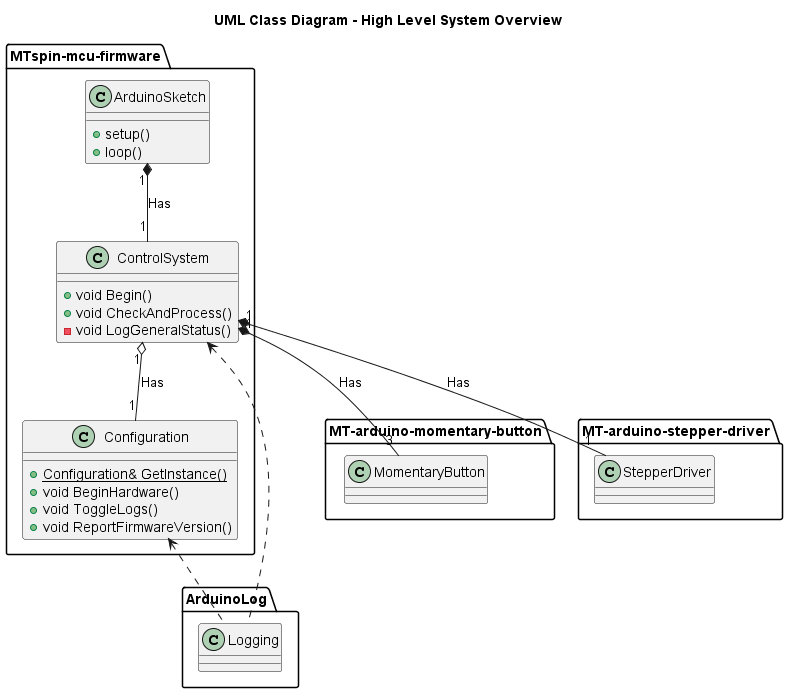

# 

## MTspin-mcu-firmware

[](https://github.com/Morgritech/MTspin-mcu-firmware/actions/workflows/static-check.yaml) [](https://github.com/Morgritech/MTspin-mcu-firmware/actions/workflows/build-project.yaml)

Microcontroller firmware for MTspin; a motorised rotating display stand.


## Introduction

### Microcontroller

Arduino UNO R4 Minima is the primary target for this project.
It is also fully compatible with Arduino UNO R3.

### Programming languages and frameworks

The primary language for this project is the [Arduino programming language](https://www.arduino.cc/reference) (a subset of C/C++).

### Coding standard

This project follows the [Google C++ Style Guide](https://google.github.io/styleguide/cppguide.html).

### Build system and programming environment/toolchain

This project doesn't impose any specific build system. See the "Setup and build" section for more details.

### Continuous integration/delivery (CI/CD)

[GitHub Actions](https://docs.github.com/en/actions) is used as the CI/CD platform, and some workflows also makes use of the [Linux setup script](external/mt-arduino-cli-scripts/setup-build-linux.sh).

### External libraries

The following libraries (available via the [Arduino library manager](https://www.arduino.cc/reference/en/libraries)) are used within the project:

- [MT-arduino-momentary-button](https://github.com/Morgritech/MT-arduino-momentary-button)
- [MT-arduino-stepper-driver](https://github.com/Morgritech/MT-arduino-stepper-driver)
- [Arduino-Log](https://github.com/thijse/Arduino-Log)

### UML class diagram

The image below shows a high level overview of the system:



## Setup and build

As with any other Arduino project, you can simply download the project and open the sketch folder ([src](src)) in the [Arduino IDE](https://www.arduino.cc/en/software). You can manually install the required libraries via the built-in library manager in the IDE, and build/compile/upload the project via the relevant options in the IDE.

OR

Leverage the [Arduino Community Edition](https://marketplace.visualstudio.com/items?itemName=vscode-arduino.vscode-arduino-community) extension for Visual Studio Code.

OR

You can work without an IDE by making use of the provided [setup/build scripts](external/mt-arduino-cli-scripts) and/or [Arduino CLI](https://arduino.github.io/arduino-cli). See the [README](external\mt-arduino-cli-scripts\README.md) for full details.

> [!NOTE]
> The scripts are included as a Git submodule. In order to bring them into the project after cloning, run the following command:

``` shell
git submodule update --init --recursive
```

> [!NOTE]
> Running the setup/build scripts will install arduino-cli and other dependencies (Arduino cores and libraries) on your device.

## System control and logging/status reporting

The project provides a means of controlling the system and interrogating the status of the system via serial messages, once the programme is uploaded to the Arduino board. The following messages are implemented:

|Message|Action|
|:----:|----|
|d|Toggle motion **direction** clockwise (CW)/Counter-clockwise (CCW).|
|a|Cycle through motion **angles**.|
|s|Cycle through motion **speeds**.|
|m|Toggle **motion** ON/OFF.|
|t|Toggle **turbo** ON/OFF.|
|r|Toggle log **reporting** ON/OFF.|
|l|**Log**/report the general system status.|
|v|Report firmware **version**.|
