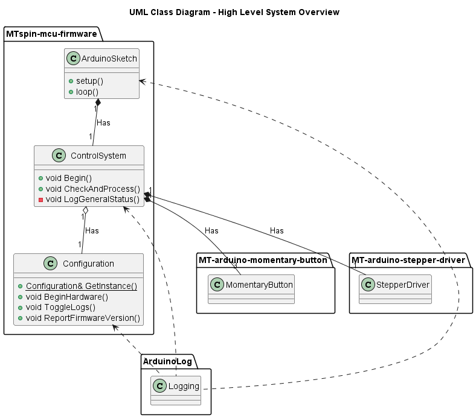

# 

## MTspin-mcu-firmware

[](https://github.com/Morgritech/MTspin-mcu-firmware/actions/workflows/static-check.yaml) [](https://github.com/Morgritech/MTspin-mcu-firmware/actions/workflows/build-project.yaml)

Microcontroller firmware for MTspin; a motorised rotating display stand.


## Introduction

### Microcontroller

Arduino UNO R4 Minima is the primary target for this project.
It is also fully compatible with Arduino UNO R3.

### Programming languages and frameworks

The primary language for this project is the [Arduino programming language](https://www.arduino.cc/reference) (a subset of C/C++).

### Coding standard

This project follows the [Google C++ Style Guide](https://google.github.io/styleguide/cppguide.html).

### Build system and programming environment/toolchain

This project doesn't impose any specific build system, however the preferred method is to make use of the tools provided by the Arduino eco-system such as [Arduino CLI](https://arduino.github.io/arduino-cli) and/or the [Arduino IDE](https://www.arduino.cc/en/software). See the "Setup and build" section for more details.

### Continuous integration/delivery (CI/CD)

[GitHub Actions](https://docs.github.com/en/actions) is used as the CI/CD platform, and the workflow also makes use of the [Linux setup script](scripts/setup-build-linux.sh).

### External libraries

The following libraries (available via the [Arduino library manager](https://www.arduino.cc/reference/en/libraries)) are used within the project:

- [MT-arduino-momentary-button](https://github.com/Morgritech/MT-arduino-momentary-button)
- [MT-arduino-stepper-driver](https://github.com/Morgritech/MT-arduino-stepper-driver)
- [Arduino-Log](https://github.com/thijse/Arduino-Log)

### UML class diagram

The image below shows a high level overview of the system:



## Setup and build

As with any other Arduino project, you can simply download the project and open the sketch folder ([src](src)) in the Arduino IDE. You can manually install the required libraries via the built-in library manager in the IDE, and build/compile/upload the project via the relevant options in the IDE.

OR

You can work without an IDE by making use of the provided [setup/build scripts](scripts) and/or Arduino CLI. You can run the setup/build scripts to automatically install the required libraries, and build/compile/upload the project as described in the following sections. This method will build the project for all boards defined in [arduino-boards.txt](arduino-boards.txt).

> [!NOTE]
> Running the setup/build scripts will install arduino-cli and other dependencies (Arduino cores and libraries) on your device. Cores are extracted from the required boards defined in [arduino-boards.txt](arduino-boards.txt) and required libraries are defined in [arduino-libs.txt](arduino-libs.txt).

### Setup and build scripts for Windows

Open a Command Prompt (CMD) terminal, navigate to the project directory, and run the commands in the following sections.

**Setup a Windows device ready to build the project.**

Install arduino-cli:

``` shell
scripts\setup-build-windows.cmd -cli
```

Install arduino-cli and add it to the Windows environment path:
> [!NOTE]
> This only updates the path in the current user session and does not persist if the session is closed. You will need to re-run the command for a new session.

``` shell
scripts\setup-build-windows.cmd -cli --path
```

Install arduino cores and libraries:

``` shell
scripts\setup-build-windows.cmd -deps
```

**Build and optionally upload the project.**

Build only:

``` shell
scripts\setup-build-windows.cmd -build
```

Build and upload:

``` shell
scripts\setup-build-windows.cmd -build --port COM3 --upload
```

Replace COM3 in the command with the desired serial port.

### Setup and build scripts for Linux

Open a terminal, navigate to the project directory, and run the commands in the following sections.

**Setup a Linux device ready to build the project.**

In order for Arduino tools to access the ports (e.g., to upload the programme to a board), your username/log-in name must be added to the dialout group:

``` shell
sudo usermod -a G dialout username
```

Replace "username" with your actual username/log-in name. You will need to log-out and back in again for changes to take effect.

Install arduino-cli:

``` shell
scripts/setup-build-linux.sh -cli
```

Install arduino-cli and add it to the Windows environment path:
> [!NOTE]
> This only updates the path in the current user session and does not persist if the session is closed. You will need to re-run the command for a new session.

``` shell
source scripts/setup-build-linux.sh -cli --path
```

Install arduino cores and libraries:

``` shell
scripts/setup-build-linux.sh -deps
```

**Build and optionally upload the project.**

Build only:

``` shell
scripts/setup-build-linux.sh -build
```

Build and upload:

``` shell
scripts/setup-build-linux.sh -build --port /dev/ttyACM0 --upload
```

Replace /dev/ttyACM0 in the command with the desired serial port.

### Running arduino-cli directly (Windows or Linux)

Once arduino-cli is installed as described above, the commands can be used directly in the terminal. This can be useful if more functionality is required, beyond what the setup and build scripts provide. See the official [Arduino CLI](https://arduino.github.io/arduino-cli) website for more information.

If you added arduino-cli to your devices environment path:

``` shell
arduino-cli <commands>
```

If you did not add arduino-cli to your devices environment path, the full path must be given with the command.

For windows:

``` shell
"%ProgramFiles%\Arduino CLI\arduino-cli" <commands>
```

For Linux:

``` shell
~/bin/arduino-cli <commands>
```

## System control and logging/status reporting

The project provides a means of controlling the system and interrogating the status of the system via serial messages, once the programme is uploaded to the Arduino board. The following messages are implemented:

|Message|Action|
|:----:|----|
|d|Toggle motion **direction** clockwise (CW)/Counter-clockwise (CCW).|
|a|Cycle through motion **angles**.|
|s|Cycle through motion **speeds**.|
|m|Toggle **motion** ON/OFF.|
|t|Toggle **turbo** ON/OFF.|
|r|Toggle log **reporting** ON/OFF.|
|l|**Log**/report the general system status.|
|v|Report firmware **version**.|
